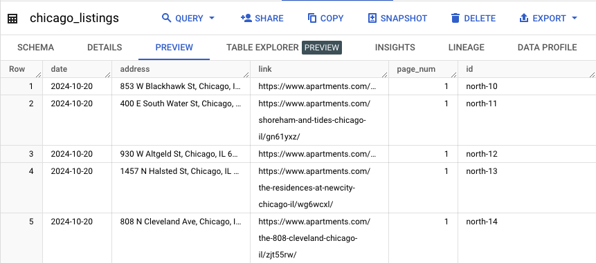
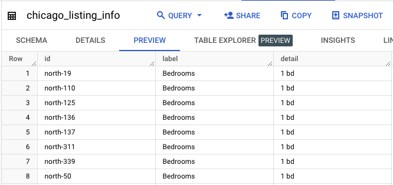

# Chicago Apartments

## Overview

Common questions when apartment hunting are "How much should I expect to pay?", "What's the average rent for this area?", or "How much space can I afford?". This project aims to help renters in the Chicago area answer those questions by providing a simple dashboard that can filtered by neighborhood, # beds, # bathrooms, and square footage.

## Features
This project does the following:

1. Scrapes Chicago apartment data from Apartments.com
2. Transforms and writes the data to BigQuery
3. Powers a dashboard in Looker Studio

## Extract

Python and the Selenium library are used to open many pages of Apartments.com search results, saving the address and listing link from all the results. The script then opens each listing and extracts key data points listed below. See `etl.py` for code.

1. Neighborhood
2. Bedrooms
3. Bathrooms
4. Monthly Rent
5. Square Feet
6. Walking Score
7. Biking Score
8. Transit Score

## Transform and Load

The extract process is repeated for listings on the north and south sides of the city, and the data is saved into two pandas dataframes. The dataframes are then written to two BigQuery tables named chicago_listings and chicago_listing_info. The first contains the listing addresses and links, and the second contains the listing info in key/value pairings (see screenshots). See `etl.py` for code.

  

  

## Dashboard

A sql query is used to bring together data from the tables so each row is one listing and the corresponding data. See `query.sql`.

This dashboard in Looker Studio looks at all the scraped listings, and shows the results based on the filters: https://lookerstudio.google.com/reporting/c21e28f4-b9f1-4e9e-a101-e06b9a4da893

## Future Improvements

1. Running the ETL on an automated basis so the data stays up to date
2. Scraping more granular sections of the city on Apartments.com to maximize the amount of results